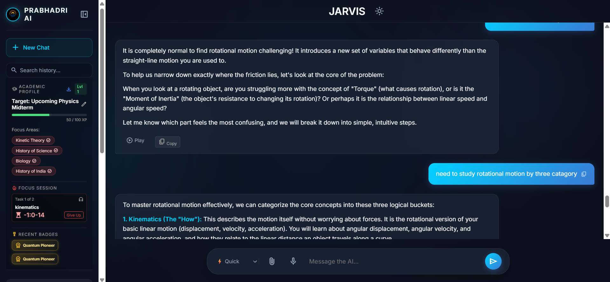

<div align="center">
  

  # 🚀 PRABHADRI AI Study Planner

  **An autonomous, gamified academic copilot designed to transform passive studying into an active learning experience.**
  
  *Hackathon Submission: Track 03 - Academic Intelligence & Learning Automation*

  
  
  
  
</div>

<br>

<div align="center">
  
</div>

---

## ⚡ Overview

PRABHADRI AI is an intelligent academic copilot designed to solve common student challenges like ineffective study planning, exam information overload, and a lack of personalized guidance. Built using advanced web technologies and the Google Gemini API, PRABHADRI acts as a real-time tutor that monitors your progress, tests your knowledge, and holds you accountable.

---

## ✨ Core Features (Prototype Ready)

- **🎮 RPG-Style Gamified Dashboard** A subject-specific tracking system where students earn XP, fill progress bars, and level up as they master their focus areas.

- **🧠 Autonomous Diagnostic Engine** An AI-driven system that scans chat logs live, detects student learning gaps, and auto-updates a local JSON weakness profile without user intervention.

- **⏱️ Offline-Resilient Focus Timer & Playlist** An automated study accountability system. Students load a study plan, start a focus timer, and are forced to pass an AI-generated pop-quiz to claim their XP.

- **🏆 Persistent Trophy Case** A sleek, visual badge system stored entirely in local memory to reward students for acing tests and maintaining discipline.

- **👁️ Multimodal Vision Integration** Upload a photo of your syllabus, test paper, or textbook diagram, and ask the AI to generate a curriculum or explain the concepts.

- **🗣️ Integrated Audio Learning** Seamless Speech-to-Text input for hands-free queries, and Text-to-Speech output for auditory learning.

- **💭 Dynamic Short-Term Memory** Retains immediate 1-turn chat context for fluid, multi-turn academic troubleshooting without losing track of the core topic.

- **📊 Exportable Study Reports** Instantly download a `.txt` report of your current level, mastered topics, and earned badges to track long-term progress.

---

## 🛠️ Tech Stack

### Frontend
- HTML5, CSS3, Vanilla JavaScript (No heavy frameworks, purely optimized for speed)
- LocalStorage API (Offline-resilient data persistence)

### Backend
- Node.js & Express.js

### AI & Integrations
- Google Gemini API (Multimodal capabilities)
- Web Speech API (Voice synthesis and recognition)

---

## 📁 Project Structure

```text
PRABHADRI-AI/
├── public/
│   ├── index.html
│   ├── style.css
│   └── script.js
├── server.js
├── .env
├── package.json
└── assets/
    └── logo.jpeg
```
## 🚀 Run It Locally

### 1. Clone the repository

```bash
git clone <your-repository-url>
cd AI-ChatBot
```

### 2. Install dependencies

```bash
npm install
```

### 3. Create the .env file

Create a file named `.env` in the root folder and add:

```env
GEMINI_API_KEY=your_actual_api_key_here
PORT=3000
```

### 4. Start the server

```bash
node server.js
```

### 5. Open the application

Visit:

```
http://localhost:3000
```
## 🎤 How to Use

1. Type your message in the chat input box.
2. Click the microphone icon to use voice input.
3. Press the send button to submit your message.
4. Receive AI-generated responses powered by Gemini.
5. Click the speaker icon to listen to AI responses.
6. Click the copy icon to copy responses instantly.
7. Create and switch between multiple chat sessions using the sidebar.

---

## 🔐 Environment Variables

The application uses the following environment variables:

| Variable       | Description                |
| -------------- | -------------------------- |
| GEMINI_API_KEY | Your Google Gemini API Key |
| PORT           | Server port number         |

Example:

```env
GEMINI_API_KEY=your_actual_api_key_here
PORT=3000
```

---


## 🔮 Future Improvements

Planned enhancements for future versions:

* Automated Full-Semester Timeline Generation: Mapping entire semesters to upcoming target exams.

* Proactive "Challenge Me" Quizzing: Automated mock tests triggered instantly and proactively from the student’s logged weak points.

* Cloud-Based Synchronization: Allowing students to maintain their XP and streaks across mobile and desktop devices.

---

## 📌 Notes

* Ensure the server is running before opening the application.
* Keep your Gemini API key private and secure.
* Do not upload your `.env` file to GitHub.
* Internet connectivity is required for AI responses.
* Local Storage is used to preserve chat history.

---

## 👤 Project

**PRABHADRI AI**

A modern AI-powered assistant designed to provide seamless text and voice interactions through an intuitive user experience.

---

## Developed by

**ADITHYAN S & GIRIDHAR H.S**

---

## 🙌 Acknowledgements

Special thanks to:

* Google Gemini API for AI capabilities
* Node.js and Express.js communities
* Open-source contributors and developers
* Bootcamp mentors and organizers
* Everyone who supports learning and innovation in AI development

---

<div align="center">

### ⭐ If you like this project, consider giving it a star!

**Built with ❤️ using JavaScript, Node.js, Express.js, and Google Gemini**

</div>