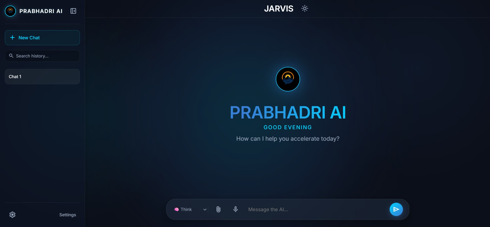

<div align="center">
  

  # 🚀 PRABHADRI AI

  **A polished AI chatbot built for fast conversations, voice interaction, and a clean modern UI.**

  
  
  
  
</div>

<br>

<div align="center">
  
</div>

---

## ⚡ Overview

PRABHADRI AI is a modern chatbot application designed with a clean interface and practical AI features. It supports chat history, local storage, voice input, voice output, copy actions, and Gemini-powered responses. The goal of the project is to create a responsive and polished AI assistant experience that feels simple, fast, and interactive.

---

## ✨ Key Features

- **Chat History Sidebar**  
  Create and switch between multiple chats easily.

- **Persistent Conversations**  
  Chats are saved in local storage and remain after refresh.

- **Voice Input**  
  Speak to the assistant and convert your voice into text.

- **Voice Output**  
  Read AI responses aloud using the browser’s speech synthesis.

- **Copy Response Button**  
  Copy chatbot replies with one click.

- **Typing Indicator**  
  Displays an AI typing state before the response appears.

- **Dark Modern UI**  
  Clean chatbot interface with a professional look.

- **Responsive Layout**  
  Works well on different screen sizes.

- **Gemini-Powered Backend**  
  Sends user messages to a Node.js + Express server and gets AI-generated responses.

---

## 🧠 Highlights

- Simple and fast chat interaction
- Multiple chat sessions
- Voice-based conversation support
- Local conversation memory
- Smooth and attractive UI
- Easy to extend with more AI features later

---

## 🛠️ Tech Stack

### Frontend
- HTML5
- CSS3
- JavaScript

### Backend
- Node.js
- Express.js

### AI
- Google Gemini API

### Other Libraries
- `cors`
- `dotenv`
- `@google/generative-ai`

---

## 📁 Project Structure

```text
PRABHADRI-AI/
├── public/
│   ├── index.html
│   ├── style.css
│   └── script.js
├── server.js
├── .env
├── package.json
├── package-lock.json
├── node_modules/
├── assets/
│   └── logo.jpeg
└── data/

## 🚀 Run It Locally

### 1. Clone the repository

```bash
git clone <your-repository-url>
cd AI-ChatBot
```

### 2. Install dependencies

```bash
npm install
```

### 3. Create the .env file

Create a file named `.env` in the root folder and add:

```env
GEMINI_API_KEY=your_actual_api_key_here
PORT=3000
```

### 4. Start the server

```bash
node server.js
```

### 5. Open the application

Visit:

```
http://localhost:3000
```
## 🎤 How to Use

1. Type your message in the chat input box.
2. Click the microphone icon to use voice input.
3. Press the send button to submit your message.
4. Receive AI-generated responses powered by Gemini.
5. Click the speaker icon to listen to AI responses.
6. Click the copy icon to copy responses instantly.
7. Create and switch between multiple chat sessions using the sidebar.

---

## 🔐 Environment Variables

The application uses the following environment variables:

| Variable       | Description                |
| -------------- | -------------------------- |
| GEMINI_API_KEY | Your Google Gemini API Key |
| PORT           | Server port number         |

Example:

```env
GEMINI_API_KEY=your_actual_api_key_here
PORT=3000
```

---


## 🔮 Future Improvements

Planned enhancements for future versions:

* Advanced Search Across Conversations
* User Authentication System
* Cloud-Based Chat Synchronization
* Enhanced Voice Controls

---

## 📌 Notes

* Ensure the server is running before opening the application.
* Keep your Gemini API key private and secure.
* Do not upload your `.env` file to GitHub.
* Internet connectivity is required for AI responses.
* Local Storage is used to preserve chat history.

---

## 👤 Project

**PRABHADRI AI**

A modern AI-powered assistant designed to provide seamless text and voice interactions through an intuitive user experience.

---

## Developed by

**ADITHYAN S**

---

## 🙌 Acknowledgements

Special thanks to:

* Google Gemini API for AI capabilities
* Node.js and Express.js communities
* Open-source contributors and developers
* Bootcamp mentors and organizers
* Everyone who supports learning and innovation in AI development

---

<div align="center">

### ⭐ If you like this project, consider giving it a star!

**Built with ❤️ using JavaScript, Node.js, Express.js, and Google Gemini**

</div>
